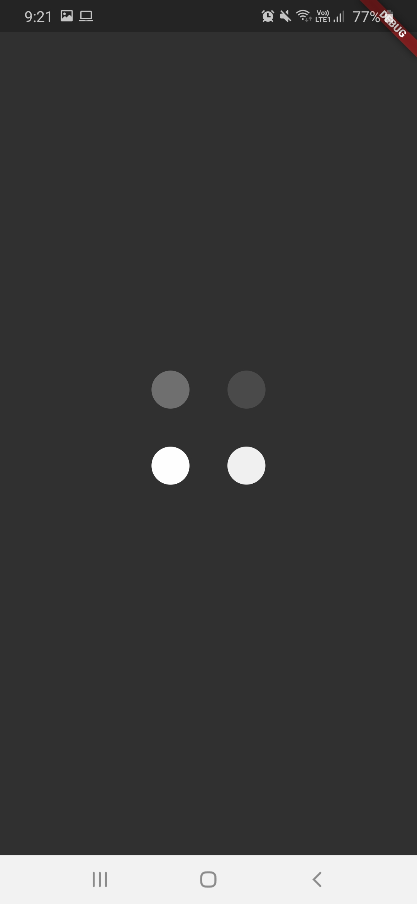

# Current Trends

- Created the frontend with Flutter and used widgets of material library to create the user interface.
- Used <a href="https://newsapi.org/">News API</a> to fetch the top head-lines for a particular keyword, as searched by the user.

&nbsp;&nbsp;&nbsp;&nbsp;&nbsp;&nbsp;&nbsp;&nbsp;&nbsp;&nbsp;&nbsp;&nbsp;&nbsp;&nbsp;&nbsp;&nbsp;&nbsp;&nbsp;&nbsp;&nbsp;
